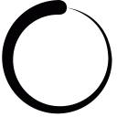
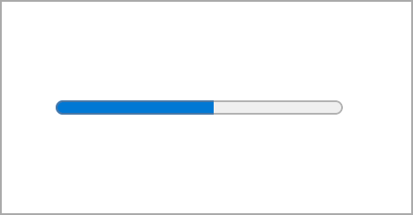
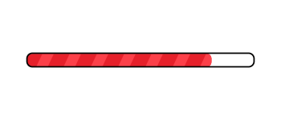
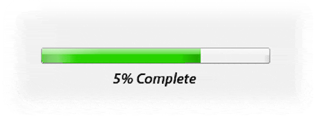
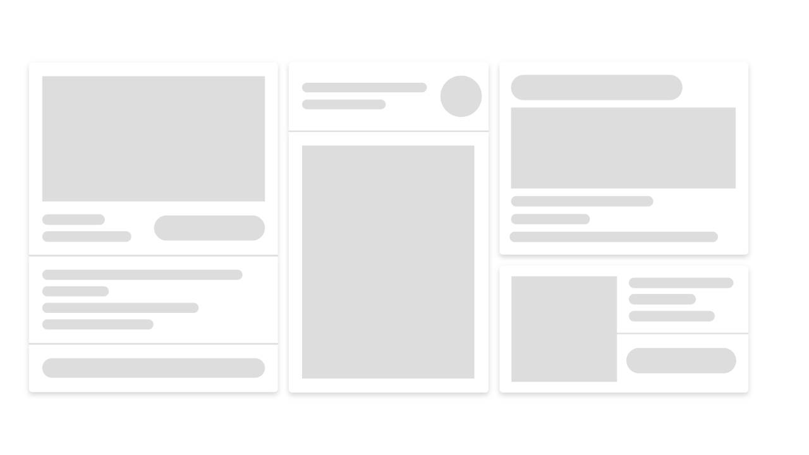
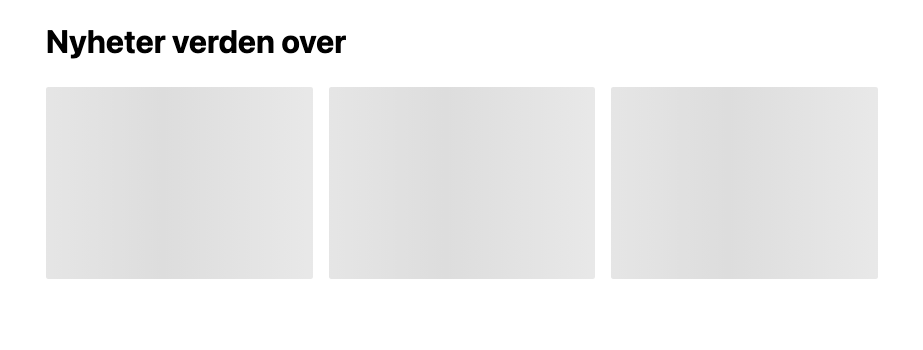
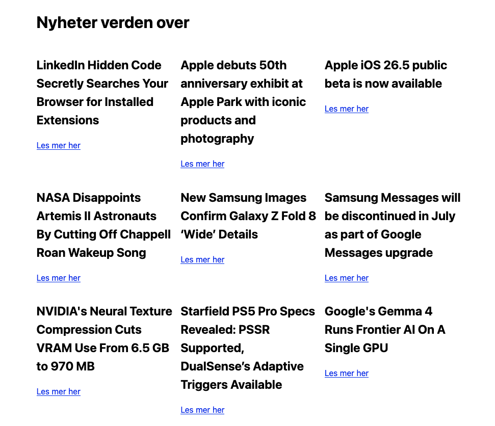

# Loading states

Når vi lager grensesnitt med asynkron datautveksling og andre handlinger som kan ta noe tid å gjennomføre er det viktig at vi informerer brukeren om at noe er i ferd med å skje i grensesnittet. Det vanligste virkemiddelet vi har for å gjøre dette er gjennom **loading states**. Som regel ser vi disse som små animasjoner i grensesnittet, for eksempel ved bruk av spinnere, progress bars eller skeletons.

## Spinnere

Spinnere er kjekke å bruke når vi trenger et innlastingsikon og har begrenset plass i skjermbildet. Disse er også vanlige å bruke når vi indikerer at en hel side er i ferd med å laste inn; da kan man midtstille spinneren i skjermbildet og bruke en backdrop som skjuler grensesnittet for brukeren helt til informasjonen er ferdig med å laste inn. I det siste tilfellet er det også vanlig at spinneren er noe større, og det er god UX-skikk å bruke en tekst i tillegg som indikerer hva som skjer for brukeren. 

## Progress bars

Progress bars brukes til å indikere at noe er i ferd med å skje i et grensesnitt, og at det er en prosess som er **målbar** — for eksempel om brukeren har startet en prosess med å laste opp mange bilder, prosessere mange dokumenter eller lignende. Det er vanlig å bruke disse i oppgaver som består av flere steg, og der hvert fullførte steg kan gjøre at baren fylles opp noe. Dersom prosessen brukeren jobber med ikke har målbare steg som kan regnes ut i prosent, er det ikke vanlig å bruke en progress bar.

## Skeletons

Skeletons er vanlige å bruke i grensesnitt der vi har data som skal vises, og vi ønsker å indikere for brukeren at det kommer til å finnes data på en bestemt plass etter en viss tid. Dersom vi har bilder som lastes inn, data i kort-komponenter eller lignende, er det vanlig å lage en skeleton-komponent med en liten gradient-animasjon som "pulserer", for så å bytte ut denne med en komponent som inneholder de faktiske dataene når innlastingen er fullført.

UX-messig er skeletons fine å bruke fordi man kan "hinte" om hvordan strukturen i grensesnittet vil være når datainnlastingen er ferdig. Brukere kan "scanne" et grensesnitt som bruker skeletons med øynene og dermed kunne ane noe om hva de vil få se når dataene faktisk er klare. Dette øker gjenkjennbarheten i løsningen, særlig når brukeren har brukt appen over noe tid og blitt kjent med grensesnittene. 

## Hva er egentlig forskjellen, og når skal jeg bruke den ene over den andre?

Det er noen fundamentale forskjeller mellom de tre metodene vi har sett på.

Progress bars har et tydelig bruksområde: dersom du har mange handlinger som skal skje i sekvens og du vil indikere for brukeren hvor langt prosessen har kommet, kan du bruke en progress bar. Hvordan man regner ut hvor mange prosent en fullført handling skal representere kan være forskjellig fra applikasjon til applikasjon; dersom vi vet at noen av prosessene er tyngre og tar lenger tid, kan disse stå for en større del av prosentandelen i progress baren. Det vanligste er nok å dele den opp i antall handlinger som skal utføres; dersom 10 handlinger står i kø, blir det 100% / 10 på hver handling, altså 10%.

Spinnere og skeletons kan være vanskeligere å velge mellom siden begge indikerer at vi venter på å motta data, uten å spesifisere noe rundt hvor lang tid det vil ta før løsningen er klar til å brukes. Det er allikevel et par spørsmål vi kan stille om løsningen som kan gjøre det enklere å velge.

### Laster vi inn data fra flere enn én kilde?

Spinnere og skeletons er forskjellige i at skeletons egner seg bedre dersom vi har mange komponenter som laster inn data fra forskjellige kilder. La oss si at vi er i ferd med å lage et sosialt nettverk, og vi skal lage forsiden som brukeren ser når de har logget inn. Vi kan ta utgangspunkt i noe som minner om Facebook for eksempelet vårt.

På forsiden har vi en **feed** med innhold fra brukere vi følger. I tillegg til feeden har vi en **navigasjon** som skal se litt annerledes ut, kanskje ut fra hvilke grupper i nettverket vi tilhører eller hvilke rettigheter vi har; noen valg skal bare være tilgjengelig dersom vi er en administrator, mens andre skal være tilgjengelig for alle. I tillegg har vi en **brukeravatar** som skal vise profilbildet vårt og innlogget status, og også en **chat-funksjon** som skal vise oss hvilke brukere vi er venn med som er pålogget og som vi kan sende meldinger til.

De uthevede ordene er hint om hvilke datakilder vi har: alle disse funksjonene vil ofte ha sine egne endepunkter i APIet som driver løsningen. I store og mer komplekse applikasjoner som sosiale nettverk er det vanlig at datakildene er **modulariserte** slik at vi kan spørre om de dataene vi trenger, når vi trenger dem. Fordi dataene er så forskjellige i struktur og størrelse betyr det også at noen endepunkter vil svare raskere enn andre. La oss ta utgangspunkt i eksempelet ovenfor og si at vi har følgende datakilder:

+ **Feed-API** som bruker 10 sekunder på å svare
+ **Navigasjons-API** som bruker 2 sekunder på å svare 
+ **Brukerprofil-API** som bruker 2 sekunder på å svare
+ **Chat-API** som bruker 6 sekunder på å svare

Svartidene er eksempler, men det tegner et bilde om hvorfor skeletons kan være et bedre valg for denne løsningen: dersom en bruker bare ønsker å gå til innstillingene i brukerprofilen sin, og disse er tilgjengelige allerede etter 2 sekunder, gir det liten mening at brukeren skal vente til 10 sekunder er gått sånn at dataene fra feed-APIet er klare. I dette tilfellet vil det gi mening å bruke skeletons fordi komponentene i grensesnittet er uavhengige av hverandre for å fungere; funksjonaliteten de ulike komponentene tilbyr er avgrensede nok til at man ikke trenger å vente på andre data for å bruke dem.

Vi er litt bortskjemte i Norge med at vi som regel har ganske raske enheter og raske nettlinjer. Men det gjelder ikke alltid, og ikke for alle brukere. Dersom vi sitter på fjellet og har dårlig dekning, kan vi kanskje regne med at det tar fem-seks ganger så lang tid å få de samme dataene, og da kan det fort gå et minutt før vi har fått lastet inn feeden på siden! Da er det en klar fordel at vi laster inn det vi kan når det er klart, slik at vi ikke blokkerer brukeren fra å gjøre det de ønsker lenger enn vi må.

I noen tilfeller har vi bare én datakilde og ett endepunkt vi forholder oss til når vi laster inn data. Da mister vi fordelen ved å bygge opp grensesnittet asynkront, men kan fremdeles ha fordelen av det UX-messige rundt skeletons kontra spinnere.

### Vet vi hvordan det ferdige grensesnittet ser ut før dataene lastes inn?

Dersom vi har et dynamisk grensesnitt som bygges opp på bakgrunn av dataene som kommer inn, kan det være tilfeller der vi ender opp med vidt forskjellige skjermbilder. I disse tilfellene kan det være vanskelig å bygge opp et midlertidig grensesnitt med skeletons fordi vi ikke vil forvirre brukeren ved å plutselig endre grensesnittet for dem. Her kan det være fordelaktig å bruke en spinner i stedet for, og vise denne for så å generere riktig grensesnitt når dataene er tilgjengelige.

Ofte vil deler av layouten vår være repeterbar, som for eksempel headerseksjon med sidenavigasjon og lignende. Disse trenger vi ikke gjemme bak en spinner om det ikke er strengt nødvendig. Her kommer det igjen litt an på akkurat hva slags løsning vi lager.

### Laster vi inn mer enn rene JSON-data, for eksempel bilder og video som endrer layout og utseende dramatisk?

Noen ganger bruker vi APIer for å laste inn store grafiske elementer som skal vises på en side, for eksempel om vi har en porteføljeside der vi vil laste inn videoer og bilder og store illustrasjoner. Når disse ikke er lastet inn og tilgjengelige i nettleseren vil vi ende opp med store, tomme blokker som plutselig forandrer seg brått når innholdet er ferdig med å laste. Dette er ikke ønskelig og fører ofte til at vi får store forflytninger i layouten vår, som igjen fører til en dårligere score i f.eks Google Lighthouse.

I tilfeller som dette er det en fordel å bruke et eget skjermbilde som vises mens alle dataene laster, ikke ulikt en loading screen av den typen man bruker i dataspill. Dette skjermbildet er som regel heldekkende og ligger som en overlay som så fjernes eller fades ut når siden er ferdig med å laste i bakgrunnen. Du kan for eksempel se på [CubiFlow](https://www.cubiflow.com) sine nettsider for et eksempel.

## Så hvordan løser vi dette i kode?

Det er flere måter å implementere spinnere og skeletons i kode, og du vil se litt forskjellige fremgangsmåter ut fra om det er brukt rammeverk eller ikke og hvordan arkitekturen i prosjektet er lagt opp. Derfor kan det være at du vil se litt forskjellige løsninger om du gjør research på nettet. 

Vi skal ta en titt på litt eksempelkode for bruk av skeletons som ligger i [dette repositoryet](https://github.com/vegarcodes/skeleton-example) som inneholder et veldig enkelt eksempel. Referer til repositoryet for å se den komplette koden.

### Steg 1: lag et mount point

Når vi jobber med DOM-manipulering sammen med datauthenting fra eksterne kilder har vi ofte behov for å gjøre flere enn én endring av DOMen; dette kan være fordi vi bruker skeletons som så byttes ut med faktiske komponenter med data i, det kan være fordi vi har en "last mer"-knapp som skal hente data i paginert format, og kanskje vi trenger å laste flere skeletons når vi venter på mer data. 

Vi trenger å isolere en seksjon av siden vår der alle disse DOM-handlingene skal skje. Det vanlige er at vi lager et tomt element på siden og gir det en ID slik at vi kan få tak i det med JavaScript, og som garanterer at elementet er unikt ettersom det bare er lov å bruke en ID ett enkelt sted på siden. Denne seksjonen kaller vi for et **mount point** — et element der resultatet av TypeScript-logikken vår skal vises.

Begrepet "mount point" kommer vi til å komme mer borti når vi skal begynne med rammeverk, ettersom alle moderne frontendrammeverk i praksis fungerer på samme måten: vi lager et tomt element i HTML med en bestemt ID og gir rammeverket tilgang til elementet så det kan gjøre DOM-manipulering mot det.

I vårt tilfelle bruker vi `<section id="news"></section>` i index.html som et mount point. Vi legger opp til at dette elementet skal endres av TypeScript-koden vår og vi fyller derfor ikke ut med noe informasjon.

### Steg 2: oppdeling i filer og mapper

Når vi har et mount point, kan vi begynne å se for oss et omriss av logikken. Eksempelappen vår er ganske enkel: den henter nyheter fra et API og viser dem i en nyhetskort-komponent. Så lenge vi ikke har mottatt data fra APIet skal vi vise en skeleton-struktur som forteller brukeren at lasting av data er underveis.

Vi vet dermed at vi kommer til å trenge en funksjon som laster inn data fra APIet slik vi har vist frem til nå. Dette ligger i en egen fil under `src/ts/api/news.api.ts`. Alle API-kall vi gjør i appen skal ligge i filer under denne mappa og følge samme navngivning slik at vi vet hva slags logikk som ligger i dette "spacet". 

For å beskrive dataene vi får fra APIet, ligger det en type kalt `News` i `src/ts/types/News.type.ts`. Denne er utledet fra API-responsen vi får og laget manuelt; dersom dataene vi får fra APIet endrer seg på et senere tidspunkt blir vi nødt til å oppdatere denne typen og kanskje også andre deler av appen.

Så langt virker dette forhåpentligvis ganske kjent ettersom vi har gjort dette noen ganger tidligere, men nå skal vi introdusere en tredje filtype: en komponentfil, som ligger i `src/ts/components/newsCard.component.ts` —  denne filen inneholder all UI-logikk for nyhetskortet. All funksjonalitet som håndterer DOM-manipulering og oppbyggingen av grensesnittet ligger i denne filen. 

Når vi snakker om frontendutvikling snakker vi ofte om "komponenter". Som regel gjelder dette grensesnitt-komponenter som er gjenbrukbare i en eller annen grad på tvers av løsningen vår; du er nok allerede kjent med dette konseptet fra CSS i at vi ofte lager gjenbrukbare klasser og CSS-regler som beskriver hvordan en knapp, et kort eller en sidenavigasjon ser ut. Det er vanlig at vi også bruker JavaScript/TypeScript, kanskje med et rammeverk som React eller Vue, til å lage gjenbrukbare komponenter som håndterer all DOM-manipuleringen for oss. På denne måten sikrer vi at markupen som er brukt også er lik fra side til side, ettersom vi sentraliserer logikken som bygger opp grensesnittet på ett enkelt sted.

I vårt tilfelle har vi bare én komponent: nyhetskortet som viser nyhetene våre. 

### Steg 3: funksjoner

Vi har ikke så mange funksjoner i den enkle nyhetsappen vår, men vi skal gå gjennom dem allikevel.

#### Inne i `src/ts/api/news.api.ts`

`async getTechnologyNews()` er funksjonen som henter data fra endepunktet vårt, filtrerer dem slik at vi bare får nyheter om teknologi, og returnerer disse. Om det oppstår en feil underveis kaster vi den ut slik at vi kan gjøre feilhåndtering som vanlig. Denne funksjonen ser forhåpentligvis ganske kjent ut for deg per nå; om ikke kan du hoppe noen steg bakover i fagstoffet og lese om hvordan `fetch()` og asynkrone funksjoner virker.

#### Inne i `src/ts/components/newsCard.component.ts`

I komponentfilen vår ligger det to funksjoner: `renderNewsCardSkeleton(amount)` og `renderNewsCard(newsItem)`. 

`renderNewsCardSkeleton(amount)` har ansvaret for å lage skeleton-komponentene våre. `amount`-parameteret sier hvor mange skeleton-kort den skal lage for oss, slik at vi ikke trenger å gjenta funksjonskallet flere ganger for å få flere skeleton-kort. Dette er spesielt praktisk til skeletons siden det lar oss kontrollere størrelsen på grensesnittet som lages på en enkel måte. Fordi disse kortene ikke inneholder noen informasjon og bare er til dekorasjon, bruker vi `
`-elementer for å ikke knytte noen semantikk til dem.

`renderNewsCard(newsItem)` har ansvaret for å gjøre om en enkelt nyhetssak, altså et objekt av typen `News` som vi har vært inne på tidligere, om til et kort i grensesnittet. Her tar vi ikke hele arrayet med nyhetssaker vi får fra API-kallet fordi det er fordelaktig å ha litt kontroll på gjenbruken: i noen tilfeller vil vi bruke funksjonen til å bare vise én enkelt sak, mens i de tilfellene der vi vil lage en liste med saker, kan vi bruke iterasjon over arrayet for å lage dem. 

### Steg 4: styling av skeleton

Når vi lager et skeleton-kort er det vanlig å legge på en liten animasjon som gjør at det ser ut som om kortet "pulserer" med en liten gradient. Denne animasjonen kalles ofte for "shimmering", og det er mange forskjellige eksempler på denne typen animasjon på nettet hvis du er interessert i å gjøre research selv.

I vårt tilfelle ønsker vi bare å lage en helt enkel og grei animasjon som ser riktig ut for formålet. I `src/css/components/news-card.css` ligger all styling som er forbundet med nyhetskortet vårt, både for skeleton-varianten og ellers.

Stylingen er forholdsvis enkel: vi har laget en regel for `.news-card` som sier at alle elementer som bruker klassen skal ha hvit bakgrunn og litt padding og border-radius. I tillegg sier vi at dersom elementet også har klassen `.skeleton`, skal den bruke en annen bakgrunnsfarge og også legge på en gradient. Vi setter `min-block-size` for å gi kortet en minstehøyde på 12rem. I tillegg har vi lagt inn en litt mystifistisk regel: `& > * { display: none; }`. Denne har vi der for å gjemme alt innholdet i kortet når det er et skeletonkort, i tilfelle vi har en fast overskrift som ikke kommer fra APIet eller lignende.

#### `@keyframes` og `animation`

Trikset som får dette til å se ut som om kortet "pulserer" er animasjonen som er lagt på. Når vi jobber med CSS-animasjoner trenger vi to ting: en `@keyframes`-regel som beskriver animasjonen vi vil legge på, og en `animation`-property i regelen der animasjonen faktisk skal brukes. Du kan tenke på dette litt som at `@keyframes` er litt som en funksjon i TypeScript: den brukes først når den kalles på, og dette skjer bare når vi legger til `animation`. 

`@keyframes` kan være store, voldsomme regler å forholde seg til når vi lager større animasjoner, men i prinsipp er de ganske enkle: vi beskriver hva som skal skje fra animasjonen starter til animasjonen slutter. Noen ganger trenger vi mange steg i animasjonen, og da kan vi bruke prosent for å si hva som skal skje etter animasjonen har kjørt så og så mange prosent.

I vårt tilfelle bruker vi en langt enklere mekanisme: vi spesifiserer bare `from` og `to`. `from` sier hvordan elementet skal se ut i starten av animasjonen, og `to` hvordan det skal se ut i slutten. I vårt tilfelle bruker vi `background-position` for å flytte gradienten fra venstre mot høyre slik at den starter helt på venstre side og så går helt til høyre side.

Men `@keyframes` spesifiserer bare hvordan animasjonen skal se ut, ikke hvor lang tid den skal ta eller om den skal gjentas. Det er her `animation`-propertyen kommer inn i bildet. 

Hvis vi ser på regelen ser vi at det står `animation: shimmer 1250ms infinite linear`. Dette er det vi kaller en **shorthand-property** i CSS, som gjør at vi kan skrive inn alle reglene på én linje. Her sier vi, fra venstre mot høyre, at
+ `shimmer`: navnet på keyframes-animasjonen som skal kjøres er "shimmer",
+ `1250ms`: varigheten fra start til slutt skal være 1250 millisekunder,
+ `infinite`: animasjonen skal fortsette å kjøre til evig tid,
+ `linear`: animasjonen skal bruke en linjær timingfunksjon (du kan lese mer om timingfunksjoner på MDN for å få eksempler på andre timingfunksjoner du kan bruke).

### Steg 5: sammensying

Med funksjonene og stylingen på plass kan vi nå begynne å snakke om hva som skjer i **kjøretiden**, altså når brukeren kommer inn på siden og scriptet begynner å kjøre. Vi har de enkeltstående komponentene vi trenger, men må sy dem sammen i `src/ts/index.ts`. Logikken ser omtrent slik ut:

+ Begynn med å lage en referanse til elementet vi skal bruke, altså mount point'et vårt.
+ Sjekk at elementet ikke er `null` ved å bruke en `if`-sjekk.
+ Først må vi vise skeleton-kortene for brukeren siden vi ikke har noen data å vise frem. Vi kaller derfor på `renderNewsCardSkeleton()`-funksjonen vår som lager noen skeleton-kort for oss, og **mounter** dem med `replaceChildren`-metoden. Begrepet "mounting" relaterer seg til "mount point"; vi tar elementene vi har laget med DOM-manipulering og legger dem inn på siden.
+ Når skeleton-kortene er oppe, kan vi begynne å hente data. Vi kaller først på `getTechnologyNews()` som henter dataene fra APIet, og deretter bruker vi `Array.map()` — denne metoden tar et array og gjør det om til et annet array. I vårt tilfelle vil vi ta `News`-arrayet vi har fått og gjøre det om til et array av nyhetskort-komponenter. 
+ Deretter bruker vi `replaceChildren()` igjen for å **mounte** nyhetskortene. Fordi `replaceChildren()` fjerner alle children som ligger der fra før, blir altså alle skeleton-kort byttet ut med de faktiske nyhetskortene.

## Konklusjon

Ved å gjennomgå denne teksten og se på den tilhørende koden har du forhåpentligvis lært det viktigste: **spinnere og skeletons er egentlig bare vanlige HTML-elementer med en slags animasjon knyttet til seg.** Det er faktisk ikke noe mer mystisk enn som så.

Det du forhåpentligvis også har lært noe av er hvordan vi kan bruke funksjoner som gjør små ting og deretter "sys sammen" til en større helhet; en funksjon for å hente data, en funksjon for å lage skeletons, og en funksjon for å lage nyhetskort. Dette gjør resultatet mer modulært og oversiktlig enn om man skulle ha én stor fil hvor all koden ligger klumpet sammen, og det gjør det også lettere å utvide løsningen når det er behov for det.

**Kan du bruke det du har lært i dag for å lage en tilsvarende løsning med en spinner?** Kan du bruke `@keyframes` til å lage en "loading screen" der fargen endrer seg jo lenger man venter? Hvilke timing functions har vi for animasjoner, og kan man lage sine egne? Hva med progress bars? Kan du lage en enkel progress bar hvis du gjør 10 requests mot et API? 