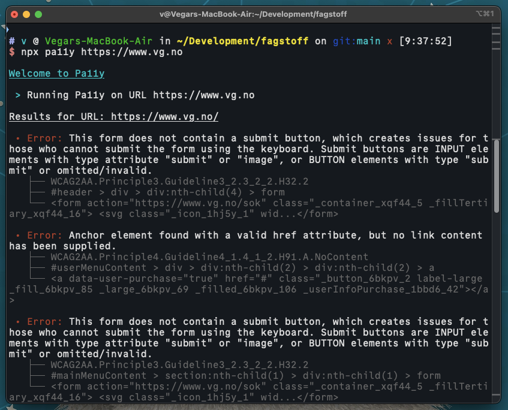
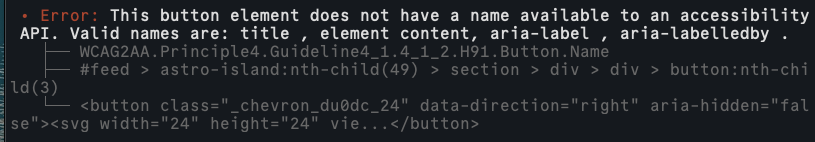

# Testing av universell utforming

Når vi jobber med å lage nettsider og apper er det viktig at vi tester om det vi har laget er universelt utformet i henhold til norsk lovgivning. Dette gjelder uansett hva vi lager og hvem vi lager det for; lovverket skal sikre at vi har likt grunnlag for deltakelse i samfunnet, uansett hvilke forutsetninger vi har.

I denne teksten skal du få en oversikt over forskjellige verktøy du kan bruke og bør være kjent med når du skal gjøre denne testingen. Dette er ikke en uttømmende liste over verktøy eller metodikk, men skal fungere som et utgangspunkt for at du kan lære mer på egenhånd. Vi går heller ikke gjennom bruk av og testing med hjelpemidler som skjermlesere, leselist eller andre assisterende verktøy; dette må du selv lese mer om på egenhånd.

Vi fokuserer i all hovedsak på det tekniske aspektet ved testing av universell utforming her, som vil si at vi kommer til å forholde oss mest mulig til det kodemessige. 

## Hva trenger jeg for å teste universell utforming?

Til å starte med må du ha en nettleser; den du bruker til vanlig vil stort sett fungere helt fint, men for oss som jobber med frontendutvikling er det vanlig at vi tester i forskjellige nettlesere med forskjellige motorer. De vanligste og viktigste er:

+ Google Chrome, Microsoft Edge eller andre Chromium-baserte nettlesere.
+ Mozilla Firefox eller nettlesere som er basert på denne, f.eks Waterfox eller Zen.
+ Apple Safari.

Du kommer til å trenge en forståelse av hvordan det norske lovverket for universell utforming er skrudd sammen. Den beste kilden for å lære mer om dette er [uutilsynet](https://uutilsynet.no) sine nettsider. Her finner du informasjon om lovverket og om testing, og du kan lese rapporter fra tilsyn som har blitt gjort tidligere år om du vil.

I tillegg skal vi lære om noen forskjellige typer testverktøy som vi som utviklere kan ha bruk for. Vi er fremdeles avhengige av menneskelig testing; oppgaven med å teste om en løsning er universelt utformet kan ikke automatiseres bort. Flere og flere selskaper reklamerer med at de har "løst" universell utforming av nettsider gjennom produkter de selger, blant annet såkalte "accessibility overlays", men disse vil aldri kunne erstatte en nettside som i utgangspunktet er universelt utformet.

## Enkelt og greit: testing av en side fra terminalen

For rask testing av nettsider er terminalverktøyet [pa11y](https://www.npmjs.com/package/pa11y) utmerket til formålet. Når vi skal bruke verktøyet oppgir vi en URL vi ønsker testet, enten det er en side som kjører lokalt på vår egen maskin eller ute på nettet, og pa11y går gjennom den angitte siden og gjør en automatisert testing i forhold til WCAG-standarden. Deretter får vi beskjed om testen var vellykket eller ei, og hvilke eventuelle feil som har oppstått på siden.

For hver feil får vi en beskrivelse av hva som har skjedd, etterfulgt av hvilket kriterium i WCAG-spesifikasjonen som er brutt, hvor i DOM-treet feilen oppsto, og den spesifikke HTML-taggen som trigget feilen i utgangspunktet. På denne måten kan vi slå opp i WCAG-spesifikasjonen og lese mer om feilen som oppsto og hvordan denne kan løses.

Fordi pa11y er et terminalverktøy kan det også brukes til automatisert testing i forhold til bygg, deploy og innsjekking til GitHub; det er også lett å installere verktøyet som en del av et prosjekt og sette opp testing av løsningen med en enkel kommando.

### Sette opp pa11y for automatisert uu-testing i et Vite-prosjekt

**La oss si at du skal sette opp automatisert uu-testing i prosjektet dere jobber med dette semesteret.** Vi går ut fra at prosjektet har tre HTML-sider vi ønsker å teste:

+ index.html
+ minside.html
+ booking.html

Fordi tre forskjellige gruppemedlemmer jobber med disse sidene, er det lurt å sette opp automatisert testing slik at det er lett å få oversikt over løsningens status som en helhet. Til dette skal vi bruke pa11y-verktøyet og **npm scripts**, der målet er å kunne kjøre kommandoen `npm run uu` for å kjøre testene.

## Testing av en side med WAVE

## Testing av et kodeprosjekt med Axe