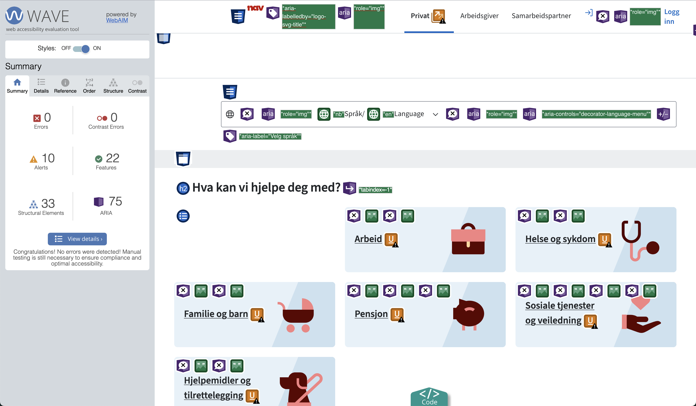
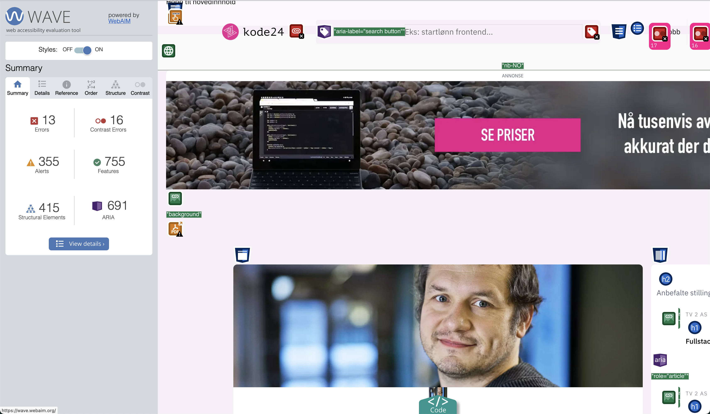
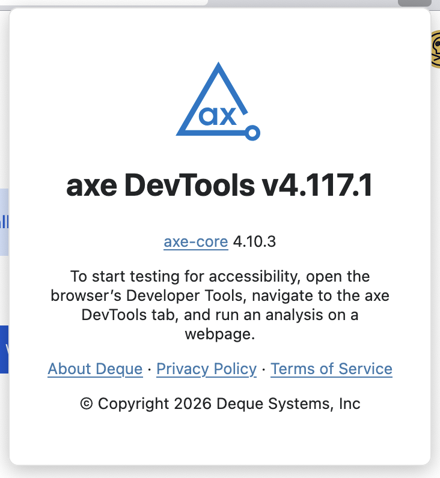
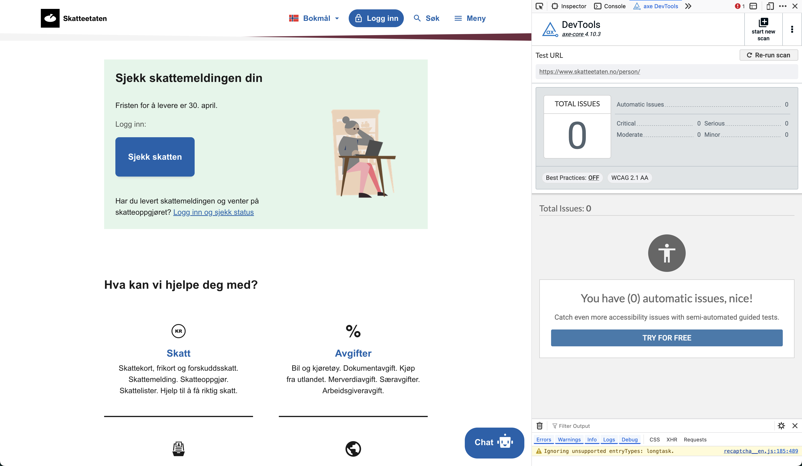
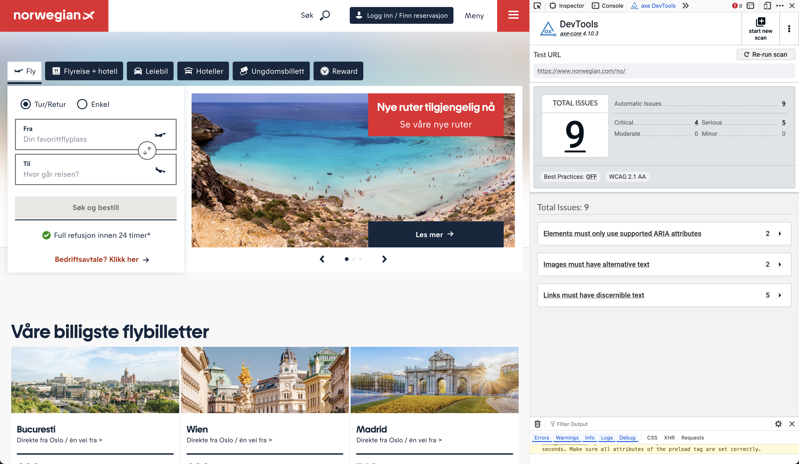
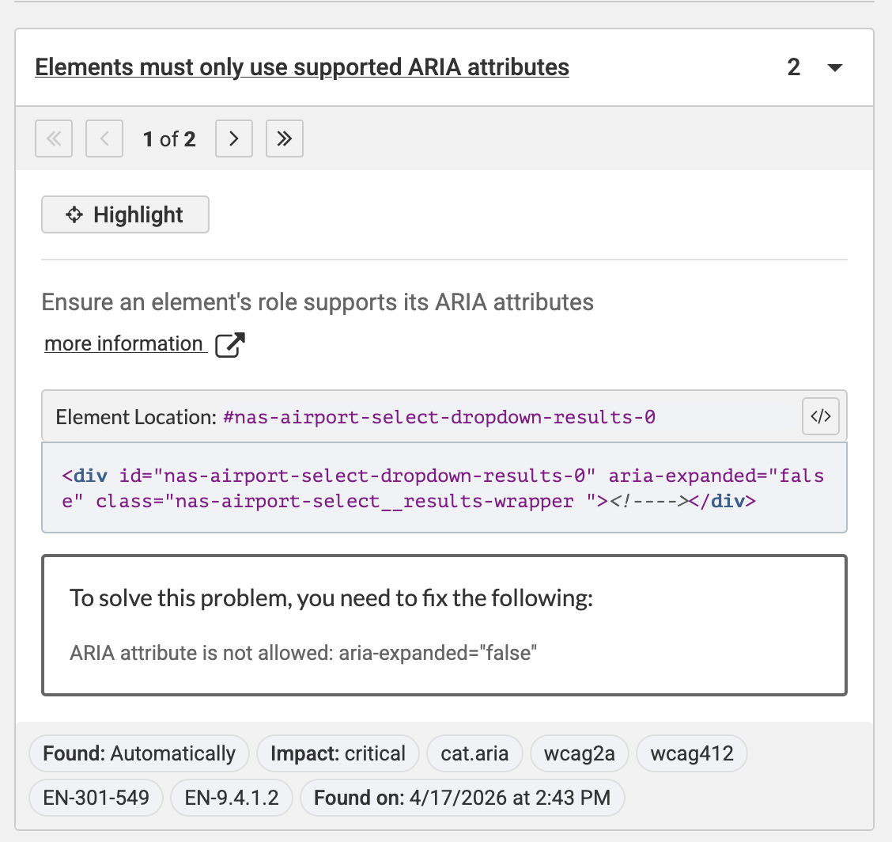

# Testing av universell utforming

Når vi jobber med å lage nettsider og apper er det viktig at vi tester om det vi har laget er universelt utformet i henhold til norsk lovgivning. Dette gjelder uansett hva vi lager og hvem vi lager det for; lovverket skal sikre at vi har likt grunnlag for deltakelse i samfunnet, uansett hvilke forutsetninger vi har.

I denne teksten skal du få en oversikt over forskjellige verktøy du kan bruke og bør være kjent med når du skal gjøre denne testingen. Dette er ikke en uttømmende liste over verktøy eller metodikk, men skal fungere som et utgangspunkt for at du kan lære mer på egenhånd. Vi går heller ikke gjennom bruk av og testing med hjelpemidler som skjermlesere, leselist eller andre assisterende verktøy; dette må du selv lese mer om på egenhånd.

Vi fokuserer i all hovedsak på det tekniske aspektet ved testing av universell utforming her, som vil si at vi kommer til å forholde oss mest mulig til det kodemessige. 

## Hva trenger jeg for å teste universell utforming?

Til å starte med må du ha minst én nettleser; den du bruker til vanlig vil stort sett fungere helt fint, men for oss som jobber med frontendutvikling er det vanlig at vi tester i forskjellige nettlesere med forskjellige motorer. De vanligste og viktigste er:

+ Google Chrome, Microsoft Edge eller andre Chromium-baserte nettlesere.
+ Mozilla Firefox eller nettlesere som er basert på denne, f.eks Waterfox eller Zen.
+ Apple Safari.

Du kommer til å trenge en forståelse av hvordan det norske lovverket for universell utforming er skrudd sammen. Den beste kilden for å lære mer om dette er [uutilsynet](https://uutilsynet.no) sine nettsider. Her finner du informasjon om lovverket og om testing, og du kan lese rapporter fra tilsyn som har blitt gjort tidligere år om du vil.

I tillegg skal vi lære om noen forskjellige typer testverktøy som vi som utviklere kan ha bruk for. Vi er fremdeles avhengige av menneskelig testing; oppgaven med å teste om en løsning er universelt utformet kan ikke automatiseres bort. Flere og flere selskaper reklamerer med at de har "løst" universell utforming av nettsider gjennom produkter de selger, blant annet såkalte "accessibility overlays", men disse vil aldri kunne erstatte en nettside som i utgangspunktet er universelt utformet.

## Enkelt og greit: testing av en side fra terminalen


For rask testing av nettsider er terminalverktøyet [pa11y](https://www.npmjs.com/package/pa11y) utmerket til formålet. Når vi skal bruke verktøyet oppgir vi en URL vi ønsker testet, enten det er en side som kjører lokalt på vår egen maskin eller ute på nettet, og pa11y går gjennom den angitte siden og gjør en automatisert testing i forhold til WCAG-standarden. Deretter får vi beskjed om testen var vellykket eller ei, og hvilke eventuelle feil som har oppstått på siden.


For hver feil får vi en beskrivelse av hva som har skjedd, etterfulgt av hvilket kriterium i WCAG-spesifikasjonen som er brutt, hvor i DOM-treet feilen oppsto, og den spesifikke HTML-taggen som trigget feilen i utgangspunktet. På denne måten kan vi slå opp i WCAG-spesifikasjonen og lese mer om feilen som oppsto og hvordan denne kan løses.

Fordi pa11y er et terminalverktøy kan det også brukes til automatisert testing i forhold til bygg, deploy og innsjekking til GitHub; det er også lett å installere verktøyet som en del av et prosjekt og sette opp testing av løsningen med en enkel kommando.

### Sette opp pa11y for automatisert uu-testing i et Vite-prosjekt

**La oss si at du skal sette opp automatisert uu-testing i prosjektet dere jobber med dette semesteret.** Vi går ut fra at prosjektet har tre HTML-sider vi ønsker å teste:

+ index.html
+ minside.html
+ booking.html

Fordi tre forskjellige gruppemedlemmer jobber med disse sidene, er det lurt å sette opp automatisert testing slik at det er lett å få oversikt over løsningens status som en helhet. Til dette skal vi bruke pa11y-verktøyet og **npm scripts**, der målet er å kunne kjøre kommandoen `npm run uu` for å kjøre testene.

Først må pally-verktøyet installeres som en del av prosjektet slik at det havner i node_modules når man installerer avhengigheter etter å ha klonet prosjektet. Det gjør du ved å kjøre følgende kommando:

```bash
npm install --save-dev pa11y
```

Det vi sier er at vi ønsker å installere pakken som heter pa11y, og at det er en avhengighet som bare brukes til utvikling av prosjektet. Derfor skal pakken legges i `devDependencies`-lista i package.json. Når kommandoen har kjørt ferdig ligger verktøyet klart til bruk. **Merk:** husk at `npm install` må kjøres på nytt dersom listen over avhengigheter har endret seg! npm installerer ikke automatisk avhengigheter den mangler, så dette må gjøres manuelt.

Deretter skal vi legge til et **npm script** som kjører kommandoen for oss. npm scripts er kommandoer og små script vi kan kjøre i et prosjekt ved å kjøre kommandoen `npm run <navn på script>` fra terminalen, slik som `npm run dev` og `npm run build` som vi har vært gjennom tidligere. I et vanlig Vite-prosjekt kan vi gå inn i package.json og finne følgende seksjon:

```json
"scripts": {
  "dev": "vite",
  "build": "tsc && vite build",
  "preview": "vite preview"
}
```

Dette er en liste over hvilke npm scripts vi har i prosjektet. Vite kommer med noen scripts ut av esken, men vi kan lage så mange som vi trenger til våre egne formål. Vi skal først lage et npm script som tester index.html:

```json
"scripts": {
  "dev": "vite",
  "build": "tsc && vite build",
  "preview": "vite preview",
  "uu:index": "pa11y http://localhost:5173/index.html"
}
```

Her har jeg laget et npm script som kan kjøres ved å skrive `npm run uu:index`, og når scriptet kjører, vil pa11y kjøre uu-tester mot localhost:5173/index.html og returnere resultatet. **En ting å merke seg her er at du må ha kjørt `npm run dev` for å starte utviklingsserveren før du kjører dette scriptet.** Den enkleste måten å gjøre dette på er å starte en ny terminal og deretter kjøre scriptet derfra. Mange synes det er knotete å ha flere terminaler oppe samtidig, men dette er i stor grad en vanesak.

Nå som vi har laget et npm script for å teste index.html kan vi kopiere kommandoen og endre den for å kjøre mot de andre HTML-sidene våre, sånn som dette:

```json
"scripts": {
  "dev": "vite",
  "build": "tsc && vite build",
  "preview": "vite preview",
  "uu:index": "pa11y http://localhost:5173/index.html",
  "uu:minside": "pa11y http://localhost:5173/minside.html",
  "uu:booking": "pa11y http://localhost:5173/booking.html"
}
```

Dermed har jeg vi kommandoer for å teste hver av sidene i løsningen vår automatisk med pa11y. Nå skal vi sy disse kommandoene sammen slik at vi har én kommando som tester alle sidene i løsningen. Fordi npm scripts kan kalle på andre npm scripts i samme prosjekt trenger vi bare et npm script som peker på de som allerede finnes. Det gjør vi på følgende måte:

```json
"scripts": {
  "dev": "vite",
  "build": "tsc && vite build",
  "preview": "vite preview",
  "uu:index": "pa11y http://localhost:5173/index.html",
  "uu:minside": "pa11y http://localhost:5173/minside.html",
  "uu:booking": "pa11y http://localhost:5173/booking.html",
  "uu": "npm run uu:index && npm run uu:minside && npm run uu:booking"
}
```

Når vi nå kjører kommandoen `npm run uu` i terminalen, vil pa11y kjøre tester mot alle de tre sidene vi har satt opp. Dersom vi nå ønsker å legge til testing av flere sider etterhvert, kan vi legge til nye npm scripts for disse og endre uu-scriptet i tillegg.

Med en slik løsning på plass er det god skikk at man blir enige om at uu-testene ikke skal returnere noen feil før man merger pull requests — dette sikrer at det blir mindre feil i løsningen. Det er den som har skrevet koden som har ansvaret for å påse at testene passerer.


## Testing av en side med WAVE

For manuell testing av en side kommer du til å trenge et testverktøy som kan kjøre i nettleseren. Et godt alternativ her er [WebAIM sitt WAVE-verktøy](https://wave.webaim.org/extension/), som er et browser-tillegg du kan installere for både Chrome og Firefox. Denne extensionen kan så brukes til å finne feil og mangler på nettsider. Etter installasjon vil det dukke opp et lite ikon, normalt i toolbaren til høyre for adressefeltet (eller du kan velge å legge den et annet sted). Ved å trykke på dette ikonet vil du få opp WAVE-verktøyet for å gjøre tester.



Når verktøyet kjører, endres innholdet på siden som testes slik at man kan se informasjon om hvordan innholdet er strukturert. WAVE viser blant annet informasjon om:

+ Landemerker og roller
+ ARIA-attributter
+ Strukturelle elementer som overskrifter
+ Navigasjonselementer
+ Feil og advarsler

I skjermbildet ovenfor har WAVE-verktøyet kjørt på NAV sine nettsider, og avdekket at det ikke er noen store kodefeil på siden. Det er noen varsler, men disse varslene handler ofte om ting man må gjennomgå manuelt uansett, for eksempel for bildetekster og alternative tekster og om disse gir mening eller ei. 



På kode24, derimot, finner WAVE-verktøyet en del feil som både handler om kodekvalitet, men også kontrastfeil der kontrasten mellom fargene på siden er for lav. Her er det viktig å sjekke, for noen ganger kan WAVE-verktøyet ha problemer med å finne riktig forgrunnsfarge og bakgrunnsfarge når den skal måle; der er derfor det er viktig med menneskelige sjekker underveis og å ikke stole blindt på verktøyet. For å måle fargekontrast manuelt, kan du for eksempel bruke [WebAIM sin kontrastsjekker](https://webaim.org/resources/contrastchecker/).

**Forsøk å kjøre WAVE-verktøyet på kode24 sine nettsider.** Kan du se hva de 13 feilene på siden handler om? Klarer du å finne ut av hvordan de skal fikses? 


## Testing av en side med axe DevTools

[axe DevTools](https://www.deque.com/axe/devtools/web-accessibility) er ganske likt i konsept som WAVE-verktøyet: det er et browsertillegg som lar deg gjøre testing av en side fra nettleseren. Forskjellen på de to er at axe DevTools har integrasjoner mot rammeverk som React dersom man bruker dette, og at axe har en litt større mengde verktøy for testing underveis i utviklingsprosessen. Kort forklart kan man si at WAVE er et mer generelt verktøy for flere typer brukere og testere, mens axe DevTools er mer utviklersentrert. 

Du kan finne axe DevTools for [Chrome](https://chromewebstore.google.com/detail/axe-devtools-web-accessib/lhdoppojpmngadmnindnejefpokejbdd) og [Firefox](https://addons.mozilla.org/en-US/firefox/addon/axe-devtools/). Når du har installert tillegget, får du beskjed om å åpne utviklerverktøyene i nettleseren for å kjøre verktøyet derfra.



Deretter kan du navigere deg til en side, gå til axe DevTools-tabben i utviklerverktøyene, og kjøre en test av siden du er på herfra. La oss ta en titt på Skatteetaten sine sider og se hva axe DevTools synes om disse.



Skatteetaten ser ut til å ha gjort en riktig god jobb med universell utforming av sidene sine. Hva så da med et annet, privateid eksempel som Norwegian?



Her var det noen feil, og når vi trykker på en av dem, gir axe DevTools ikke bare en beskrivelse av feilen og hvor den oppsto, men også forslag til hvordan feilen bør rettes opp:



Dette kan være spesielt nyttig dersom man er litt ny til koding og universell utforming, siden man får litt mer informasjon om konkrete rettinger man kan gjøre.

**Installer axe DevTools og forsøk å kjøre det på Norwegian sine sider.** Kan du finne ut hvilke feil som har oppstått på siden, og komme med noen forslag til hvordan de bør fikses med axe DevTools som hjelp?


## Ekstratips: bruk axe Accessibility Linter for å oppdage feil underveis i utviklingsprosessen

Det kan være lett å gjøre feil når man sitter og skriver HTML-kode, og jo fortere man oppdager feil man gjør, jo lettere er de å fikse. Når du sitter og koder kan du bruke [axe Accessibility Linter](https://marketplace.visualstudio.com/items?itemName=deque-systems.vscode-axe-linter), som er et tillegg i VS Code, til å oppdage feil og mangler i koden mens du jobber med den.


## Oppgaver

+ Du skal ta utgangspunkt i [Tesla sine hjemmesider.](https://www.tesla.com/no_no/) Du kan begynne med å kun jobbe med forsiden. Begynn med å ta en titt på siden — ser du noen potensielle problemer med universell utforming uten å titte på koden? Virker siden bra eller dårlig utformet?
+ Bruk pa11y for å ta en scan av siden, og ta en titt på resultatene opp mot gjennomgangen av norsk lovgivning som uutilsynet har laget. Hvilke lovkrav, om noen, bryter Tesla på sine sider?
+ Bruk WAVE for å undersøke siden. Hvilke feil avdekker WAVE på siden?
+ Bruk axe DevTools for å undersøke siden. Hvilke feil avdekker axe DevTools?
+ Sammenlign funnene du har gjort. Hvilket verktøy avdekket flest feil? Hvilket verktøy avdekket færrest feil? Er verktøyene enige eller uenige om funnene på siden?
+ Dersom du skulle forsøke å fikse noen av feilene du har funnet på siden, hvordan ville du ha gått frem for å videreutvikle og teste? 

Gjenta denne prosessen for tre nettsider av ditt eget valg. Forsøk å sammenligne norskproduserte sider med sider som er produsert i f.eks USA eller Storbritannia. Er det noen vesentlig forskjell i hvor mange feil som oppstår og hvilke feil dette er? Hva kan grunnen være til det?
